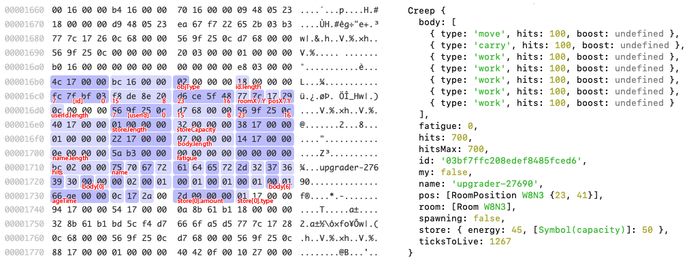
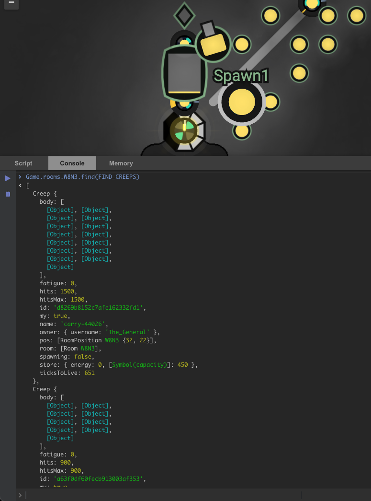

# xxscreeps

This is a from-scratch rewrite of the Screeps backend services, brought to you by the author of
the [path finder](https://github.com/screeps/driver/blob/master/native/src/pf.cc) and also
[isolated-vm](https://github.com/laverdet/isolated-vm). The goal of this project is to build a very
fast version of the Screeps backend service which will greatly improve upon the local single-player
experience, and perhaps eventually the multiplayer world as well.


## Concepts

### Blobs
At the heart of xxscreeps is a custom binary format created specifically to efficiently represent
the state of a room. Instead of storing a sea of objects indexed by room in a shared database, each
room is stored as a blob ranging in size from 250 bytes to 60kb for most rooms. A room blob
represents game state in the same way a C program might represent it. For reference, a simple object
like a `StructureWall` can be represented in 44 bytes, and a creep with a fully loaded
50-length body is about 274 bytes.



The first advantage of this is greatly improved performance of the runner service. Game state is
read from the database as an
[`ArrayBuffer`](https://developer.mozilla.org/en-US/docs/Web/JavaScript/Reference/Global_Objects/ArrayBuffer)
which can be *instantly* transferred into the player's runtime for free. In vanilla Screeps the
process of requesting game state from the database and loading it into the runner requires several
costly serialization and deserialization steps.

The real crazy part is that we can overlay JavaScript game state directly *on top* of these room
blobs. Inherited [getters](https://developer.mozilla.org/en-US/docs/Web/JavaScript/Reference/Functions/get)
are created which reach into the blob and pull out game state as it requested by the user's script.
So, for example, if you go an entire tick without accessing the `body` property on a `Creep`, that
array along with all its contents will never be materialized into the v8 heap. This greatly reduces
the burden of the garbage collector which robs every player of a significant portion of CPU.

Storage of room blobs can be efficiently sharded within a world shard as well. These blobs are no
different than a very small JPEG file, like from the 90's. We could theoretically infinitely scale a
game world in all directions by linearly adding more processor workers.

### Parallelization
In xxscreeps room processing can begin as soon as all player scripts in a single room have
completed. Most rooms are only accessible by 1 or *maybe* 2 users at a time. Right now in vanilla
Screeps the processor service just sits around doing nothing until *all* player scripts are done. By
overlapping running and processing we can improve scalability of a world shard.

### Modernization
[Private class
fields](https://developer.mozilla.org/en-US/docs/Web/JavaScript/Reference/Classes/Private_class_fields),
[proxies](https://developer.mozilla.org/en-US/docs/Web/JavaScript/Reference/Global_Objects/Proxy),
[reflection](https://developer.mozilla.org/en-US/docs/Web/JavaScript/Reference/Global_Objects/Reflect),
and a custom [Babel](https://babeljs.io/) transform have simplified the player sandbox
implementation. We can now share code between the runtime and processor and implement game logic
using the same APIs that the player uses. Compare the work needed to implement a Creep's `transfer`
method in xxscreeps:
[[Creep.prototype.transfer](https://github.com/laverdet/xxscreeps/blob/4fd2b89528b6e270f4ae45b810d1a464cdc285fd/src/mods/creep/creep.ts#L299-L307),
[checkTransfer](https://github.com/laverdet/xxscreeps/blob/4fd2b89528b6e270f4ae45b810d1a464cdc285fd/src/mods/creep/creep.ts#L396-L408),
and ['transfer'
intent](https://github.com/laverdet/xxscreeps/blob/4fd2b89528b6e270f4ae45b810d1a464cdc285fd/src/mods/creep/processor.ts#L72-L79)]
to the same feature in vanilla Screeps:
[[Creep.prototype.transfer](https://github.com/screeps/engine/blob/78631905d975700d02786d9b666b9f97b1f6f8f9/src/game/creeps.js#L428-L491),
[intents/creep/transfer.js](https://github.com/screeps/engine/blob/78631905d975700d02786d9b666b9f97b1f6f8f9/src/processor/intents/creeps/transfer.js)].
Of course the functionality in xxscreeps is incomplete in some ways but the foundation is solid.

### Mods
The "core" xxscreeps engine is meant to be abstract and extendable. Almost all game logic is
implemented as mods which can be turned on and off independently of one and other. Even `Creep`
objects are implemented a mod! As the scope of gameplay in Screeps has expanded over time it's
become more difficult to reason about any one gameplay component since its logic might be scattered
over many different and unrelated files. Furthermore by "dogfooding" the mods API we will be
confident that it's powerful and easy as possible to use.

### Experience
There's a lot of factors that can make Screeps difficult to work with. Every player of Screeps knows
the disappointment of typing `console.log(creep)` into the console and seeing `[Object object]`
echoed back. xxscreeps comes with robust console support just like you get in nodejs. Full support
for the Chrome Web Inspector or VS Code debugger is planned as well, which will make it possible to
step through your script line by line to troubleshoot issues. The whole thing is written with
detailed TypeScript annotations and inline documentation as well which greatly improves the player's
access to information about game APIs.



## Getting Started

To get xxscreeps running here's what you need to do. This should work on Linux, macOS, and Windows.
```
git clone https://github.com/laverdet/xxscreeps.git
cd xxscreeps
npm install -D
npm run build
npm run import
```

After that you can start xxscreeps via `npm run start` except you won't be able to connect with the
Steam client. You'll need to create a file `.screepsrc.yaml` with content:
```
backend:
  steamApiKey: <your steam key>
```

If you're using VS Code and you have the YAML extension installed all the options should
autocomplete. If not you can read the [config
schema](https://github.com/laverdet/xxscreeps/blob/main/src/config/schema.ts).

## Contributing

If you've read this far, hopefully you would like to help. Without support from the community
xxscreeps will definitely fail and die.

If you are a novice developer the best thing you can do is help test and provide feedback. Install
xxscreeps and get your scripts running and help find inaccuracies in the game engine.
Troubleshooting is your most valuable contribution! A bug report of "my creeps are getting stuck
when walking past sources" is not very helpful. A bug report of "`findClosestByPath` returns
`undefined` instead of `null` when there is no result" or "`transfer` and `withdraw` don't transfer
any resources when `amount === 0`; these functions should transfer the maximum amount possible in
this case" is extraordinarily helpful.

If you are a professional developer and you want to help there's still a lot of features that need
to be developed. Feel free to talk to me about the status of the project!


## Community

[Join the xxscreeps Discord](https://discord.gg/Ga4C44UP9c). Yes, I know there is already a
community Slack server with over 32,000 members, but it's time to rip this band-aid off. Open source
communities are *not* the target market for Slack. Slack only lets us access the last 10,000
messages on the server which is like 10 days of total history. *Years* of wisdom has been lost in
these channels. I can't even see my own direct messages after 30 days *even if I never actually read
the message*. Slack wants $2,900 *per month* to upgrade to the "pro" plan which buys you everything
Discord is giving away for free. Enough is enough 🙅🏼‍♂️ ! If you want to talk to me about this
project please just come over to the Discord server.
